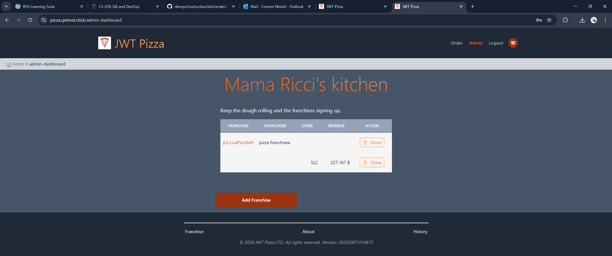
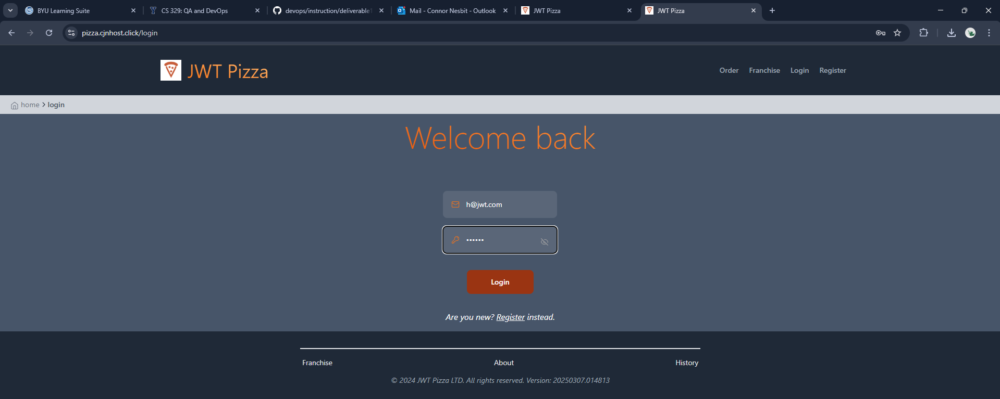
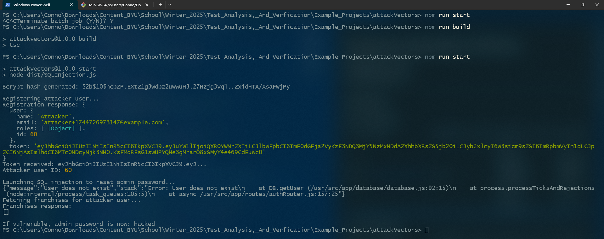
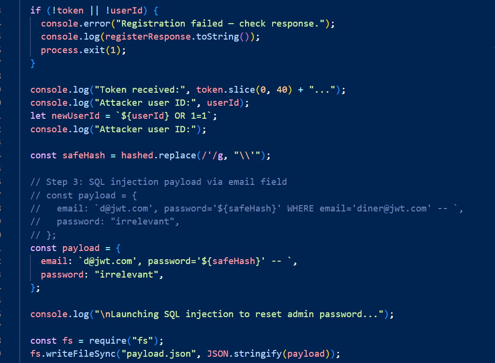
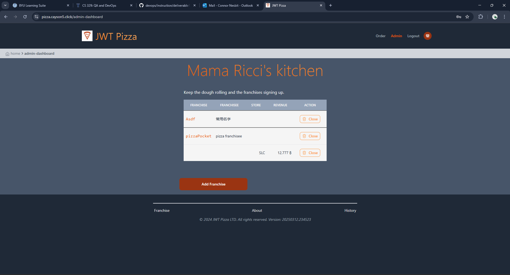
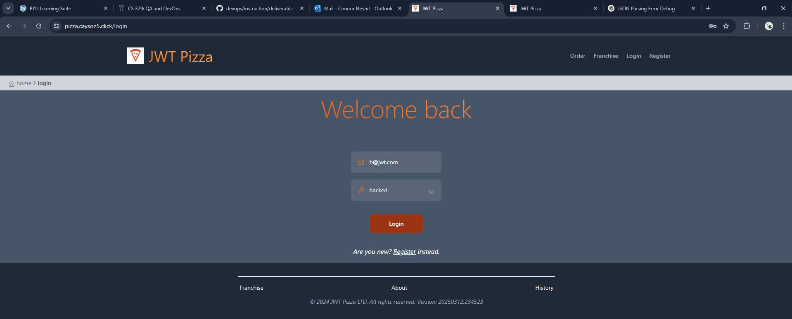
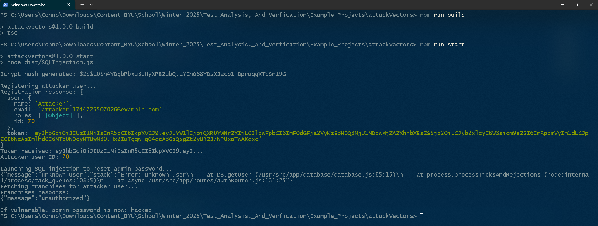

# Penetration Testing Report: JWT Pizza

**Peer 1 Name:** Connor Nesbit  
**Peer 2 Name:** Cayson Hanson  
**Peer 3 Name:** Megan Huff

---

## Self Attacks

### Peer 1 (Connor Nesbit) Self Attacks

**Date:** April 9, 2025  
**Target:** https://pizza-service.cjnhost.click  
**Classification:** Injection  
**Severity:** 2  
**Description:** SQL injection changed admin login information. Hacker now has access to all information.  
**Images:**

- 
- 
- 

**Corrections:** Fix the `updateUser` database function to prevent SQL injection.

**Date:** April 9, 2025  
**Target:** https://pizza-service.cjnhost.click  
**Classification:** Injection  
**Severity:** 1  
**Description:** I wasn't able to get a working script that would modify every single password but the potential is there.  
**Images:**

- 

**Corrections:** Fix the `updateUser` database function to prevent SQL injection.

### Peer 2 (Cayson Hanson) Self Attacks

**Date:** April 15, 2025  
**Target:** pizza-service.cayson5.click  
**Classification:** Security Misconfiguration  
**Severity:** 2  
**Description:** CORS misconfiguration that allows cross-origin requests from any domain with credentials. The server accepts requests from arbitrary origins and reflects them back in the Access-Control-Allow-Origin header, while also setting Access-Control-Allow-Credentials: true. This enables potential cross-site request forgery attacks.  
**Images:**

- CORS headers showing misconfiguration

**Corrections:** Configure CORS to only allow requests from trusted domains. Remove Access-Control-Allow-Credentials: true header for untrusted origins.

**Date:** April 15, 2025  
**Target:** pizza-service.cayson5.click  
**Classification:** Insecure Design  
**Severity:** 2  
**Description:** The application allows creation of orders with non-existent franchise and store IDs. When an order was submitted with franchise ID 999 and store ID 999 (which don't exist), the system accepted it without validation.  
**Images:**

- Response showing successful order creation with invalid IDs

**Corrections:** Implement validation to verify that franchise and store IDs exist in the database before creating orders.

**Date:** April 15, 2025  
**Target:** pizza-service.cayson5.click  
**Classification:** Insecure Design  
**Severity:** 2  
**Description:** The API doesn't validate input types. A request with a string value for franchiseId ("invalid") was accepted by the system, when it should have been rejected as this field requires a numeric value.  
**Images:**

- Response showing accepted order with string as franchiseId

**Corrections:** Implement proper type-checking for all API inputs. Reject requests with incorrect data types and provide appropriate error messages.

**Date:** April 15, 2025  
**Target:** pizza-service.cayson5.click  
**Classification:** Security Misconfiguration  
**Severity:** 2  
**Description:** The application exposes sensitive server information through headers and endpoints. The /api/docs endpoint reveals the actual database hostname, and all responses include an X-Powered-By: Express header.  
**Images:**

- API docs response showing database hostname
- Response headers showing X-Powered-By

**Corrections:** Remove X-Powered-By header. Restrict access to the /api/docs endpoint or remove sensitive details from it.

**Date:** April 15, 2025  
**Target:** pizza-service.cayson5.click  
**Classification:** Sensitive Data Exposure  
**Severity:** 2  
**Description:** JWT tokens contain excessive information, including internal system details and personal information. Decoded tokens reveal key ID information, vendor full name and ID, complete order details, and JWT signing method.  
**Images:**

- Decoded JWT token showing excessive information

**Corrections:** Minimize information stored in JWT tokens. Remove personal information and internal system details from tokens.

### Peer 3 (Megan Huff) Self Attacks

#### Attack 1

**Date:** April 15, 2025  
**Target:** https://www.pizza.meganhuff.click
**Classification:** Security Misconfiguration  
**Severity:** 5  
**Description:** "Exposure of well-known or unnecessary system configuration." I have the default admin user, which is exposed in my public docs and is available for anyone to log in.
**Images:**

- Public exposure of admin credentials
- Hacker can see this easily in the docs and log in 
- Successful login with the default credentials 

**Corrections:** Change the information for the default users in the docs so it does not expose this default information publicly. Additionally, I changed the default admin that is created by the database and removed the old default admin credentials from my production database.

#### Attack 2

**Date:** April 15, 2025  
**Target:** https://www.pizza.meganhuff.click
**Classification:**  
**Severity:**  
**Description:**
**Images:**

---

## Peer Attacks

### Peer 1 (Connor) Attack on Peer 2 (Cayson)

**Date:** April 15, 2025  
**Target:** https://pizza.cayson5.click  
**Classification:** Injection  
**Severity:** 2  
**Description:** SQL injection changed admin login information. Hacker now has access to all information.  
**Images:**

- 
- 
- 

**Corrections:** Fix the `updateUser` database function to prevent SQL injection.

**Date:** April 15, 2025  
**Target:** https://pizza.cayson5.click  
**Classification:** Security Misconfiguration  
**Severity:** 5  
**Description:** The admin and a@jwt.com information was never changed or modified to prevent access from bad actors that may know those security details.
**Images:**

- 

**Corrections:** Change the default configuration of database and reload data

### Peer 2 (Cayson) Attack on Peer 3 (Megan)

**Date:** April 15, 2025  
**Target:** pizza-service.meganhuff.click  
**Classification:** Security Misconfiguration  
**Severity:** 3  
**Description:** The server has improper CORS configuration that allows cross-origin requests from any domain. A request with Origin: https://evil-hacker.com returned Access-Control-Allow-Origin: https://evil-hacker.com and Access-Control-Allow-Credentials: true headers, enabling potential cross-site request forgery attacks.  
**Images:**

- Response headers showing CORS misconfiguration

**Corrections:** Configure CORS to only allow requests from trusted domains. Never reflect back arbitrary origins in the Access-Control-Allow-Origin header. Disable Access-Control-Allow-Credentials for untrusted origins.

**Date:** April 15, 2025  
**Target:** pizza-service.meganhuff.click  
**Classification:** Injection  
**Severity:** 3  
**Description:** The server does not properly validate input types. When sending string values where numbers are expected (`{"franchiseId": "string-not-number"}`), the server crashes and reveals a stack trace with internal file paths and function names.  
**Images:**

- Error response showing database.js file paths and function names

**Corrections:** Implement proper type validation for all user inputs. Use a validation middleware or schema validation library. Handle errors gracefully without exposing internal implementation details.

**Date:** April 15, 2025  
**Target:** pizza-service.meganhuff.click  
**Classification:** Security Misconfiguration  
**Severity:** 2  
**Description:** When requesting non-existent resources (using IDs 99999), the application reveals detailed error messages with stack traces instead of handling the error gracefully.  
**Images:**

- Stack trace from non-existent resource request

**Corrections:** Implement proper error handling for non-existent resources. Return generic 404 responses without revealing internal details. Use a centralized error handling middleware.

**Date:** April 15, 2025  
**Target:** pizza-service.meganhuff.click  
**Classification:** Broken Access Control  
**Severity:** 2  
**Description:** The chaos mode endpoint (/api/order/chaos/true) is partially accessible to non-admin users. While it doesn't enable chaos mode, it does return information about the current state (`{"chaos":false}`) rather than returning an unauthorized error.  
**Images:**

- Response showing chaos mode status

**Corrections:** Implement proper authorization checks before processing the request. Return generic 403 Forbidden responses for unauthorized access attempts without confirming the existence of the endpoint.

### Peer 3 (Megan) Attack on Peer 1 (Connor)

**Date:** April 15, 2025  
**Target:** https://pizza.cjnhost.click/admin-dasboard/create-franchise
**Classification:** Broken Access Control / Security Misconfiguration
**Severity:** 1 / 5
**Description:** It is possible to access the create franchise screen within the app without being logged in or being logged in as a user. You cannot create a franchise, but if you are logged in as a non-administrative user, it spits an error with a stack trace.
**Images:**

- 

**Corrections:** disallow front-end access to this page without authorization, cleaner and more vague error shown on the front end

---

## Combined Summary of Learnings

**Connor**: During my self and peer attacks, I discovered how SQL injection could be used to alter admin credentials and gain unauthorized access. This helped me understand the critical importance of using parameterized queries and securing all user inputs. I also modified my own database to get rid of security details that have been exposed to the public.

**Cayson**:

- The most common vulnerability found across both implementations was improper CORS configuration, which could enable cross-site request forgery attacks. Web applications should never reflect arbitrary origins in CORS headers or set Access-Control-Allow-Credentials: true for untrusted origins.

- Both implementations had issues with input validation, allowing incorrect data types to be processed. This demonstrates the importance of implementing proper type checking and validation for all user inputs before processing them.

- Information disclosure through detailed error messages and stack traces was prevalent in both implementations. Applications should implement centralized error handling that sanitizes error messages in production environments to avoid revealing internal details.

- JWT tokens often contained excessive information that could be useful to attackers. Tokens should contain minimal information and sensitive data should be stored server-side.

- Authorization checks were sometimes incomplete, allowing partial access to sensitive endpoints. Each endpoint should have thorough authorization checks that happen before any processing occurs.

- While some security measures were working correctly (JWT signature verification, basic role checking), these vulnerabilities show the importance of a defense-in-depth approach that addresses security at multiple layers.

**Megan**: Thinking about security is one of the most important ways to prevent vulnerabilities. Just being aware of certain best practices mitigates so many problems you can have in your application. Being aware of what you are showing the public and what you are committing to repositories can solve half of the issues you might face as malactors come across your websites. Assuming that people will try to crash or hack your site should be a given.

---

_Report submitted on April 15, 2025_
